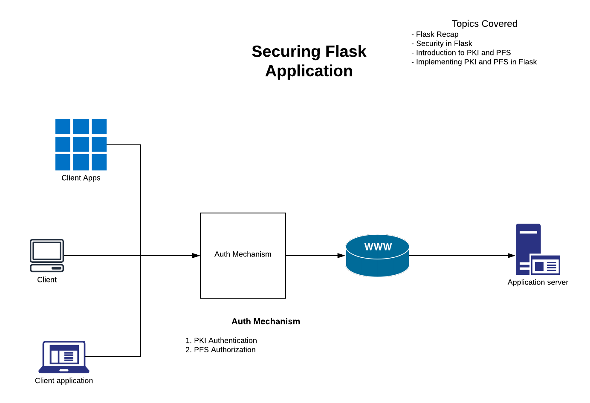
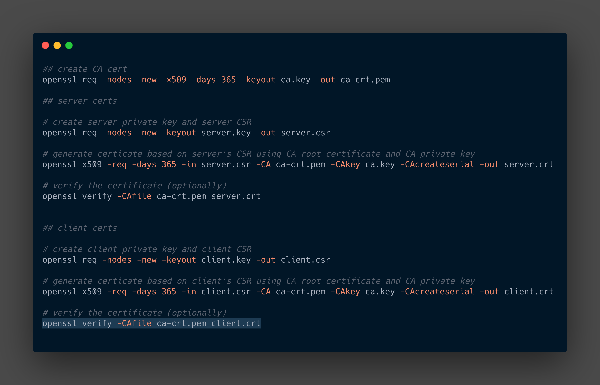

# Security in FLASK 

The project covers about securing the flask application 

### Pre-requisites 
- Basic understanding of python3 
- Good to have understanding about Flask and SSL, but not mandatory 

### workflow

  


### steps

- clone the git repository
- configure the port and host requirements in ``` config_main.py```
- run ``python script_rest.py``
- Navigate to certs folder and test the endpoint 
   
   ``
   curl -k --key ./client.key --cert ./client.crt https://127.0.0.1:1947

    {
        "mood": "howdy !!"
    }

  ``
    
 
#### Generate certs 

Certification generation used here is a basic 
PKI mechanism , more complex can be achieved , Below links can provide more complex implemnetation of PKI
create a folder certs and generate the certs

 
  
 

 
 For any queries you can reach out to **vijayadinesh93@gmail.com** 


